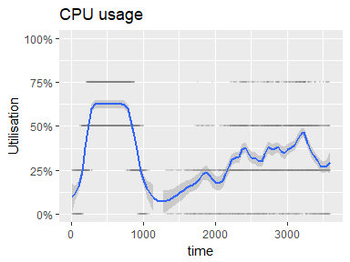
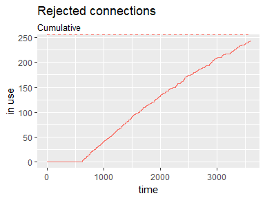

<!-- README.md is generated from README.Rmd. Please edit that file -->

# simmer.shiny

The `simmer.shiny` package contains a discrete event simulation that
explores how `shiny` processes behave at scale, typically orchestrated
by RStudio Connect or Shiny Server Pro.

The `simmer` package for discrete event simulations provides the
underlying infrastructure of the simulation.

## Installation

You can install the released version of pkg from
[CRAN](https://CRAN.R-project.org) with:

``` r
install.packages("pkg")
```

And the development version from
[GitHub](https://github.com/andrie/simmer.shiny) with:

``` r
# install.packages("devtools")
devtools::install_github("andrie/simmer.shiny")
```

## Example

The `simmer.shiny` package uses discrete event simulation to help answer
the questions:

  - How big should my Shiny server be to handle `n` number of users?
  - For a given size of server, how many users can Shiny handle?
  - How should I tune the runtime parameters in RStudio Connect for my
    app?

The robust answer to this question is to use `shinyloadtest`, but for
planning purposes you may want to rapidly develop some hypotheses and
intuition about the problem, prior to building and testing an app.

## The `simmer` package

The `simmer` package makes it easy to build discrete event simulations
in R. The `simmer.shiny` package uses `simmer` under the hood for
defining and running the simulation.

## Setting up the simulation

The `simmer.shiny` function reads a configuration file using the
`config::get()` function. The package contains a default configuration
file at:

``` r
system.file("config.yml", package = "simmer.shiny")
#> [1] "C:/Users/apdev/Documents/R/win-library/3.4/simmer.shiny/config.yml"
```

The contents of this file:

    default:
      runtime:
        max_processes: 3
        min_processes: 0
        max_connections_per_process: 20
        load_factor: 0.5
        idle_timeout_per_process: 5.0
        initial_timeout: 300
        connection_timeout: 3600
        read_timeout: 3600
      app:
        startup_time: 5.0
        reponse_time: 2.0
      user:
        arrival:
          mean: 30.0
          sd: 10.0
        request:
          mean: 10.0
          sd: 2.0
        number_of_requests: 10.0
      system:
        cpu: 4.0

## Run the simulation

``` r
library(magrittr)
library(simmer.shiny)
```

By default, the simulation runs for an hour (3,600 seconds):

``` r
env <- simmer_shiny()
env
#> simmer environment: Shiny | now: 3600 | next: 3600
#> { Monitor: in memory }
#> { Resource: connection_request | monitored: TRUE | server status: 21(60) | queue status: 0(0) }
#> { Resource: rejections | monitored: TRUE | server status: 0(Inf) | queue status: 0(0) }
#> { Resource: connection | monitored: TRUE | server status: 21(60) | queue status: 0(Inf) }
#> { Resource: cpu | monitored: TRUE | server status: 0(4) | queue status: 0(Inf) }
#> { Resource: process_1 | monitored: TRUE | server status: 6(20) | queue status: 0(0) }
#> { Resource: process_2 | monitored: TRUE | server status: 8(20) | queue status: 0(0) }
#> { Resource: process_3 | monitored: TRUE | server status: 7(20) | queue status: 0(0) }
#> { Source: controller | monitored: 1 | n_generated: 1 }
#> { Source: user | monitored: 1 | n_generated: 123 }
```

## Plots

``` r
env %>%
  plot_shiny_usage()
```



``` r
env %>%
  plot_shiny_resources()
```


``` r
env %>%
  plot_shiny_cpu_histogram()
```


